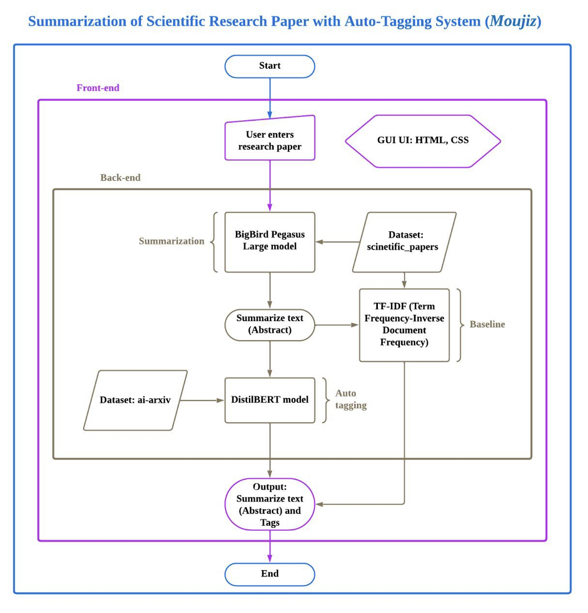

# Moujiz
Utilizing the power of transformers, Moujiz uses a text summarization model for scientific research papers                that helps in generating abstracts for researchers, including which categories the paper falls under.                                
#  Research Paper Summarization & Classification Tool

##  Project Description  
Our application offers researchers a strong tool for generating **summaries and abstracts for scientific research papers**. It leverages **advanced text summarization** and **multi-label classification** to provide comprehensive insights into academic texts.

- **Text Summarization:**  
  We employ the **BigBirdPegasusLarge (transformer-based)** model to process submitted research papers and generate concise summaries highlighting the main ideas.  

- **Scientific Paper Tagging:**  
  The **DistilBERT model**, fine-tuned for multi-label classification, assigns relevant categories to the summarized abstract, identifying the research domain.  

- **Baseline Approach (Fallback):**  
  We implemented **TF-IDF (Term Frequency – Inverse Document Frequency)** as a backup method to generate summaries if the transformer-based model encounters challenges.  

- **Evaluation Metrics:**  
  - Summaries are compared against original abstracts for **overlap and coherence**.  
  - Tagging accuracy is evaluated via **manual checking of predicted categories**.  
  - Success criterion: **≥60% performance** for both summarization and classification tasks.  

- **Deployment:**  
  Built using the **Flask framework**, the system provides an **interactive web interface** where users can submit text, receive a generated abstract, and view assigned categories.  

---

## 🏗️ System Architecture  

  

---
